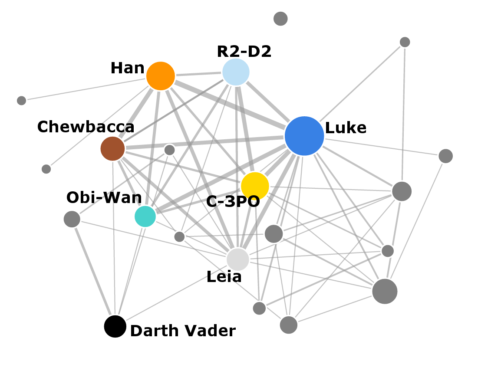

# Visualization Critique and Redesign Report

**Course:** STATS 401 — Data Acquisition and Visualization  
**Project:** *Star Wars: Episode IV — A New Hope*  
**Report body:** 795 words (references and captions excluded)
**Interactive figures:** [Open the deployed project](https://seanwan514.github.io/stats401_ind_vis_project/#redesign)

## Original visualization and context

Evelina Gabasova’s *Episode IV: A New Hope* social network is a force-directed, weighted node-link visualization derived from screenplay data. Nodes represent characters; an edge connects two characters when they speak within the same scene. Node size encodes the number of scenes attributed to a character, and link width encodes shared speaking scenes. The published “all characters” version supplements R2-D2 and Chewbacca through mention-based data because they do not speak conventional dialogue. The visualization’s intended message is that screenplay interaction reveals prominence, recurring relationships, and narrative groups. Its primary audience is *Star Wars* fans seeking a quantitative interpretation, with visualization and digital-humanities readers as a secondary audience. Intended tasks include finding prominent or peripheral characters, determining whether a pair connects, comparing relationship frequency, identifying bridges, and recognizing clusters.

*Figure 1. Gabasova’s Episode IV network, reproduced under CC BY-SA 4.0.*

## Critical evaluation

Two strengths make the original a productive starting point. First, nodes and links match an intuitive social-network model: adjacency and broad topology can be understood without specialized statistical knowledge. Second, the compact overview includes a wide cast and uses two quantitative channels, making Luke and the densely connected hero group visually salient. The familiar character names also lower the entry barrier for a general audience and make the network inviting to explore.

Four weaknesses limit effectiveness. The chart does not visibly define “interaction,” scene segmentation, node size, link width, or the treatment of non-speaking characters; viewers may therefore confuse co-occurrence with screen time or emotional closeness. Numerous marks, crossing edges, and labels create a hairball with weak visual hierarchy, while force-directed distance appears meaningful despite having no quantitative scale. Link width is also difficult to compare across orientations because it lacks alignment, ticks, or exact labels; width is a less accurate comparison channel than aligned position or luminance. Node area similarly requires a legend or direct value to support precise magnitude judgments. Finally, the aggregate network cannot show the composition of character presence, screenplay order, or the settings where scenes occur. These are not aesthetic objections: they directly obstruct lookup, comparison, clustering, and narrative-context tasks identified for the intended audience.

## Redesign rationale

The redesign is a progressive analytical sequence, not four unrelated charts. First, the node-link view directly repairs the original. It limits scope to eight declared principal characters because the clutter created by minor nodes outweighs their value for the intended tasks. A spread-out starting layout, direct captions, dragging, linked highlighting, and exact node and edge tooltips preserve intuitive topology while resolving the hairball and ambiguous-value problems. Second, the 8 × 8 adjacency matrix takes the analysis one step further: aligned cells, exact counts, sortable order, and a perceptually ordered blue scale quantify all 28 unique character pairs more reliably than unaligned link widths. The network supplies overview; the matrix supplies measurement.

Third, the treemap moves from pairwise quantity to proportional significance. Area shows each character’s share of 536 appearances accumulated by the selected cast, creating a valid additive whole without claiming that overlapping appearances partition film runtime. Fourth, the circular scene-space view returns those measurements to the movie’s narrative context. Its outer circle orders 300 relevant scenes; four inner sectors encode Tatooine, the Death Star, Yavin IV, and Outer Space/Spacecraft; and bundled curves connect every scene to its setting. Character filtering reveals spatial paths. Together, the four linked views progress from relationship overview to exact comparison, proportional presence, and story space—the broader set of tasks that fans are likely to pursue.

## Original versus redesign, trade-offs, and limitations

The dashboard makes exact pair lookup, relationship ranking, character focusing, part-to-whole comparison, and scene-location exploration easier than the original. It also distinguishes connectivity, individual presence, sequence, and setting instead of asking one diagram to represent all four concepts. The main trade-off is scope: minor characters are removed, so the original remains better for cast completeness. Treemap area is less precise than a sorted bar, and four macro-locations simplify some ship and battle settings. Most importantly, the source is the January 15, 1976 revised fourth draft, not finished-film timing. Scene presence is inferred from speaker cues and action text, and draft or rapidly cross-cut scenes may differ from the released movie. The dashboard labels these limits to prevent stronger claims than the data supports. The dashboard is therefore not an attempt to add complexity for display: fixing the network alone would still leave comparison, composition, chronology, and setting unanswered. Four views increase learning cost and page length, but short reading guides, consistent colors, direct labels, and coordinated interaction make them function as one fan-oriented final product rather than four disconnected demonstrations.

## Figures and references

Figures 2–5 are the project’s four interactive D3 redesigns and appear on the [deployed project page](https://seanwan514.github.io/stats401_ind_vis_project/#redesign).

- Evelina Gabasova, [“The Star Wars social network”](https://evelinag.com/blog/2015/12-15-star-wars-social-network/)
- Gabasova, [original visualization code](https://github.com/evelinag/StarWars-social-network)
- Gabasova, [network data repository](https://github.com/evelinag/star-wars-network-data)
- [Archived dataset on Zenodo](https://zenodo.org/records/1411479)
- [January 15, 1976 revised fourth-draft screenplay](https://imsdb.com/scripts/Star-Wars-A-New-Hope.html)

*Star Wars* names and imagery are © Lucasfilm Ltd. and are used here for educational criticism and analysis.
